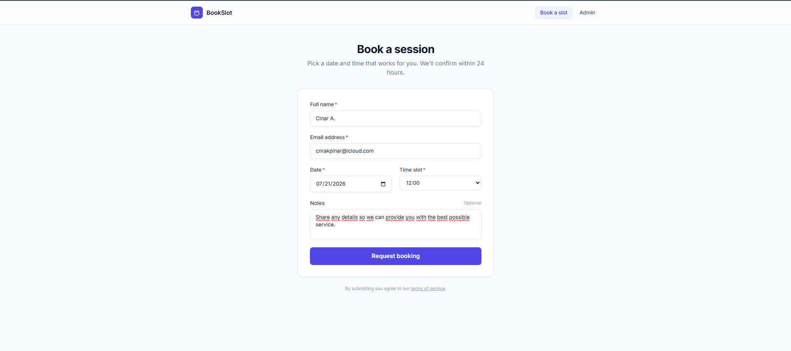
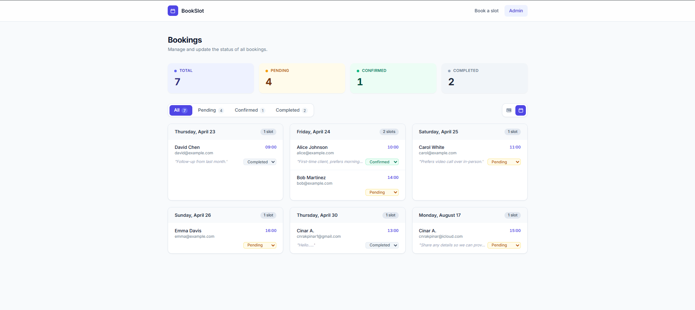

# Booking Admin System

A lightweight, modern appointment booking and management platform built for small businesses. Give your clients a seamless way to book sessions — and give yourself a clean dashboard to stay on top of every appointment.

---

## Features

- **Public booking page** — clients submit their name, email, preferred date, time slot, and any notes
- **Admin dashboard** — view all bookings in one place with a sortable, filterable table
- **Status management** — mark bookings as `Pending`, `Confirmed`, or `Completed` directly from the dashboard
- **Calendar view** — bookings grouped by date for a quick day-by-day overview
- **Live stats** — at-a-glance counters for total, pending, confirmed, and completed bookings
- **Filter by status** — instantly narrow down to only the bookings that need attention
- **Empty states** — clear, friendly prompts when no bookings are present
- **Persistent storage** — bookings saved to localStorage, no database required
- **Responsive design** — fully usable on desktop, tablet, and mobile

---

## How It Works

1. **Client visits `/booking`** — fills out the booking form with their details and preferred time slot
2. **Booking is saved** — the submission is stored and immediately visible in the admin dashboard
3. **Admin opens `/admin`** — sees all bookings with live status counts at the top
4. **Admin filters and reviews** — use the filter tabs to focus on pending bookings that need a response
5. **Admin updates status** — change any booking from `Pending` → `Confirmed` → `Completed` with a single dropdown
6. **Admin switches views** — toggle between the table view and the calendar view to plan the schedule

---

## Screenshots

### Booking Page


### Admin Dashboard


---

## Tech Stack

| Layer | Technology |
|---|---|
| Framework | [Next.js 15](https://nextjs.org/) (App Router) |
| UI Library | [React 18](https://react.dev/) |
| Styling | [Tailwind CSS](https://tailwindcss.com/) |
| State | React Context + localStorage |
| Language | TypeScript |

---

## Run Locally

**Requirements:** Node.js 18+

```bash
# Clone the repository
git clone https://github.com/cnrakpinar1-jpg/cnr-booking-system.git
cd cnr-booking-system

# Install dependencies
npm install

# Start the development server
npm run dev
```

Open [http://localhost:3000](http://localhost:3000) in your browser.

- Booking page: [http://localhost:3000/booking](http://localhost:3000/booking)
- Admin dashboard: [http://localhost:3000/admin](http://localhost:3000/admin)

---

## Use Cases

This system is built for any service-based business that takes appointments:

- **Freelancers & consultants** — manage client calls and sessions without a complex CRM
- **Beauty & wellness studios** — salons, barbershops, massage therapists, and spas
- **Coaches & tutors** — personal trainers, life coaches, and private tutors
- **Healthcare & therapy** — small clinics, therapists, and independent practitioners
- **Creative services** — photographers, videographers, and designers booking shoots or consultations
- **Any small business** that currently relies on email, WhatsApp, or spreadsheets to track bookings

---

## Goal

Missed appointments and disorganised inboxes cost small businesses real revenue. **Booking Admin System** solves this by giving businesses a dedicated, always-available booking page that clients can use at any time — and a clean admin view that makes it impossible to miss or forget an appointment.

The goal is to replace the chaos of manual booking with a simple, structured workflow: a client books, the admin confirms, the job gets done. No lost messages, no double-bookings, no confusion.

---

## License

MIT — free to use, modify, and distribute.
